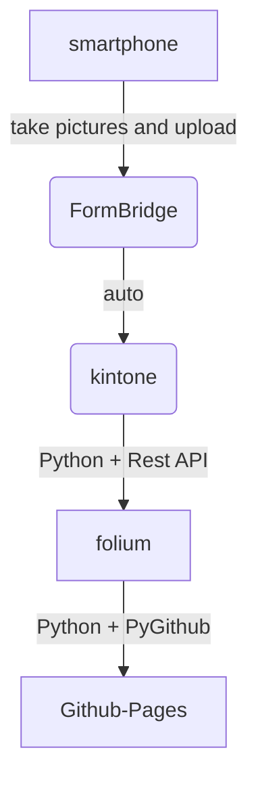

**現在テスト中のため、内容の正確性は保証されません。**

# 災害時被害マップ / Disaster Damage Map

このリポジトリは、災害時の被害箇所を地図上に可視化するためのプロジェクトです。  
This repository is a project to visualize disaster damage locations on a map.  
Folium を用いて生成した HTML 地図を GitHub Pages で公開しています。  
The HTML map generated using Folium is published via GitHub Pages.  

公開中の地図はこちらから確認できます：  
You can view the live map here:  
https://yujiuchi.github.io/disaster-map/disaster.html

## 注意事項 / Disclaimer
本リポジトリの地図は、災害時に入力された情報を元に作成しています。
This map is based on information entered during disaster situations.  
内容の正確性・最新性について保証するものではありません。
It does not guarantee accuracy or timeliness of the information.  

## 使用技術/ Technologies Used
- python 
- FormBridge + kintone
- GitHub Pages

