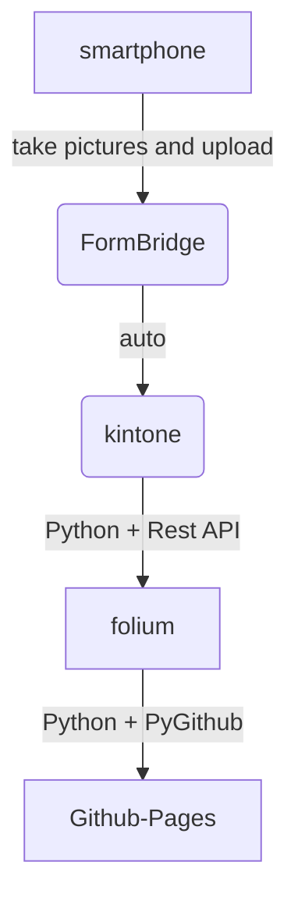

**現在テスト中のため、内容の正確性は保証されません。**

# 災害時被害マップ
このリポジトリは、災害時の被害箇所を地図上に可視化するためのプロジェクトです。  
Folium を用いて生成した HTML 地図を GitHub Pages で公開しています。  

公開中の地図はこちらから確認できます：  
https://yujiuchi.github.io/disaster-map/disaster.html

## 注意事項
本リポジトリの地図は、災害時に入力された情報を元に作成しています。
内容の正確性・最新性について保証するものではありません。

## 使用技術
- python 
- FormBridge + kintone
- GitHub Pages

